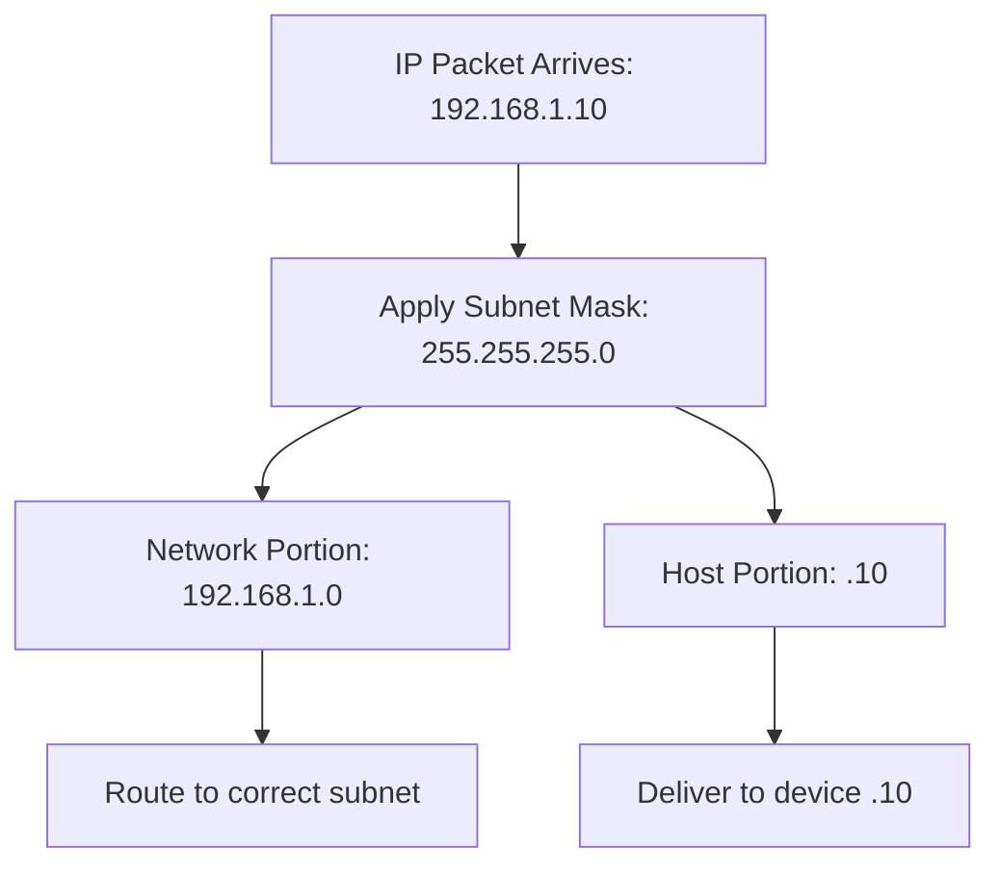
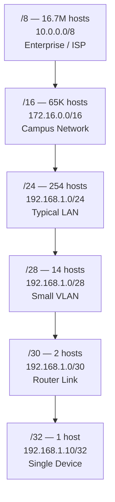

# 🌐 IP Addressing, Subnetting & CIDR — Security Deep-Dive


> *"If you cannot read the network, you cannot attack it. If you cannot attack it, you cannot defend it."*

A security-focused deep dive into **IPv4 addressing**, **RFC 1918 private ranges**, **subnet masks**, and **CIDR notation** — with practical Kali Linux labs using `ipcalc` and `nmap`. Part of the Phase 1 Networking series.

---

## 📖 Table of Contents

- [What is an IP Address?](#what-is-an-ip-address)
- [Public vs Private IP — RFC 1918](#public-vs-private-ip-rfc-1918)
- [IP Practical: Kali Terminal](#ip-practical-kali-terminal)
- [What is Subnetting?](#what-is-subnetting)
- [CIDR Notation](#cidr-notation)
- [Subnetting Practical: Lab](#subnetting-practical-lab)
- [Key Takeaways](#key-takeaways)
- [Additional Resources](#additional-resources)
- [Author](#author)

---

## 🧩 What is an IP Address?

**An IP address** is a unique logical identifier assigned to every device on a network. Think of it as a postal address for your device — without it, packets have nowhere to go.

### IPv4 Structure — 32 bits / 4 Octets

```
192      .    168      .    1        .    10
11000000      10101000      00000001      00001010
[Network]     [Network]     [Network]     [Host]
```

Each octet is **8 bits**, giving a value range of **0 to 255**.

Total address space: **2³² = ~4.3 Billion addresses**

### IPv4 vs IPv6

| Feature | IPv4 | IPv6 |
|---|---|---|
| **Bit Length** | 32-bit | 128-bit |
| **Total Addresses** | ~4.3 Billion | 340 undecillion |
| **Format** | `192.168.1.10` | `2001:0db8::1` |
| **Status** | Still dominant | Rapidly growing |

---

## 🔒 Public vs Private IP — RFC 1918

### Private IP Ranges (Not Routable on the Internet)

| CIDR | Range | Scale | Use Case |
|---|---|---|---|
| `/8` | `10.0.0.0` to `10.255.255.255` | 16.7M hosts | Large enterprises / ISPs |
| `/12` | `172.16.0.0` to `172.31.255.255` | 1M hosts | Medium networks |
| `/16` | `192.168.0.0` to `192.168.255.255` | 65K hosts | Home / small office |

> [!NOTE]
> **Public IP** is assigned by your ISP, visible on the internet, and unique globally. This is your **attack surface**. Find it with:
> ```bash
> curl ifconfig.me
> ```

### Special Addresses

| Address | Name | Purpose |
|---|---|---|
| `127.0.0.1` | Loopback | Your own machine. If this fails — network stack is broken. |
| `0.0.0.0` | Default Route | "Any destination." Used in routing tables. |
| `255.255.255.255` | Broadcast | Send to all hosts on segment simultaneously. |

> [!IMPORTANT]
> **AppSec Recon Context:** Public IP found = attack surface mapped. Private range found (post-pivot) = internal enumeration begins.
> ```bash
> nmap -sn 10.0.0.0/8
> ```

---

## 💻 IP Practical: Kali Terminal

Run these on your Kali machine. Understand what every line means.

### View All Network Interfaces

```bash
ip addr show
```

| Output | Meaning |
|---|---|
| `eth0` | Main network interface |
| `lo` | Loopback (127.0.0.1) |
| `inet` line | Your IPv4 address + CIDR notation |

### Loopback Test

```bash
ping 127.0.0.1
```

| Result | Meaning |
|---|---|
| Reply received | Network stack is alive |
| Request timeout | Something is broken at OS level |

### Test Connectivity to Target VM

```bash
ping <metasploitable-ip>
```

| Result | Meaning |
|---|---|
| Reply received | Machine is reachable |
| No reply | Firewall blocking ICMP or host is down |

### Inspect Specific Interface

```bash
ip addr show eth0
```

Look at the `inet` line. Example output: `192.168.1.100/24` — that `/24` is subnetting in action.

---

## 🔀 What is Subnetting?

**Subnetting** is dividing a large IP network into smaller sub-networks. Each subnet is an isolated broadcast domain.

**Why it matters:**

| Reason | Detail |
|---|---|
| **IP Conservation** | Do not waste 246 addresses if you only need 10. |
| **Security — Segmentation** | If an attacker compromises Subnet A, Subnets B and C stay isolated. |

### Subnet Mask — How it Works

```
IP Address :   192  .  168  .   1   .   10
Subnet Mask:   255  .  255  .  255  .    0
Binary     : 11111111 11111111 11111111 00000000
              [--- NETWORK PORTION (locked) ---]  [HOST--]
```

**Rule:**
- `255` in subnet mask = **network bits** (fixed, identifies the network)
- `0` in subnet mask = **host bits** (variable, identifies devices on that network)



---

## 📐 CIDR Notation

**CIDR (Classless Inter-Domain Routing)** was introduced by IETF in 1993 to replace the rigid Class A/B/C system.

**Notation:** `IP / prefix-length` — where prefix = number of network bits locked.

### Formula

```
Total addresses  =  2^(32 - prefix)
Usable hosts     =  2^(32 - prefix) - 2
                    (subtract network address + broadcast address)
```

### Example: 192.168.1.0/24

```
Prefix /24  →  24 bits = network portion
8 bits remaining for hosts  →  2⁸ = 256 total addresses
256 - 2  =  254 usable hosts
```

### CIDR Reference Table

| CIDR | Subnet Mask | Total IPs | Usable Hosts | Use Case |
|---|---|---|---|---|
| `/8` | `255.0.0.0` | 16.7M | 16,777,214 | Large ISPs, enterprise |
| `/16` | `255.255.0.0` | 65,536 | 65,534 | Campus / data center |
| `/24` | `255.255.255.0` | 256 | 254 | Typical LAN / home network |
| `/28` | `255.255.255.240` | 16 | 14 | Small segments / VLAN |
| `/30` | `255.255.255.252` | 4 | 2 | Point-to-point router links |
| `/32` | `255.255.255.255` | 1 | 0 (host route) | Single host |

> [!WARNING]
> **Security Context:** Attackers enumerate CIDR blocks to map the full attack surface. A `/8` block contains 16.7 million potential targets. A `/24` contains 254. Always know the scope before scanning.

### CIDR Stack Visualization



---

## 🧪 Subnetting Practical: Lab

**Tools:** `ipcalc` + `nmap` on Kali Linux against Metasploitable 2

### ipcalc — Subnet Calculator

Breaks down any CIDR block completely.

```bash
ipcalc 192.168.1.0/24
```

```
Network:   192.168.1.0
HostMin:   192.168.1.1
HostMax:   192.168.1.254
Broadcast: 192.168.1.255
Hosts/Net: 254
```

---

```bash
ipcalc 192.168.1.0/28
```

```
Network:   192.168.1.0
HostMin:   192.168.1.1
HostMax:   192.168.1.14
Broadcast: 192.168.1.15
Hosts/Net: 14
```

Compare the `/28` output to `/24` — notice how dramatically the host range shrinks.

---

```bash
ipcalc 10.0.0.0/8
```

```
Network:   10.0.0.0
HostMin:   10.0.0.1
HostMax:   10.255.255.254
Broadcast: 10.255.255.255
Hosts/Net: 16,777,214
```

This is the full RFC 1918 large enterprise range. Run this and understand the scale.

---

### nmap -sn — Host Discovery (Ping Scan)

```bash
nmap -sn 192.168.1.0/24
```

| Flag | Meaning |
|---|---|
| `-sn` | No port scan — ping only (host discovery) |
| Output | Lists all live hosts in the subnet |
| Protocol | Uses ICMP + ARP for discovery |
| Purpose | **First step of every pentest** — map who is alive |

> [!IMPORTANT]
> **Recon Context:** `nmap -sn` against a CIDR block is step one of network reconnaissance. It identifies live hosts before any port scanning begins. On an internal network post-pivot, run this against RFC 1918 ranges to enumerate the internal attack surface.

```bash
# Discover all live hosts in your lab network
nmap -sn 192.168.1.0/24

# Post-pivot internal enumeration — large enterprise range
nmap -sn 10.0.0.0/8

# Medium network range
nmap -sn 172.16.0.0/12
```

---

## 💡 Key Takeaways

> [!IMPORTANT]
> **Map the network. Own the network.** Every offensive and defensive operation begins with understanding the address space. CIDR literacy is not optional.

| # | Takeaway |
|---|---|
| **01** | **IPv4 = 32 bits / 4 octets.** Value: 0 to 255 per octet. Total: ~4.3B addresses. Format: `192.168.1.10` |
| **02** | **Private ranges (RFC 1918).** `10.x`, `172.16-31.x`, `192.168.x` — not routable on the internet. Your lab network lives here. |
| **03** | **Subnetting = network division.** Subnet mask separates network bits from host bits. Security benefit: segmentation contains breaches. |
| **04** | **CIDR /24 = 254 usable hosts.** Formula: `2^(32-prefix) - 2`. `/30` = 2 hosts. `/32` = single host route. |
| **05** | **ipcalc + nmap -sn.** `ipcalc` breaks down any CIDR block. `nmap -sn` finds all live hosts. Together = recon step one. |

---

## 🔗 Additional Resources

- 📺 **Watch the Tutorial:** [IP Addressing & Subnetting — Full Walkthrough in Urdu/Hindi](https://www.youtube.com/@MuhammadAqibTayyab)
- 📊 **Original Deck:** [Download Presentation (PPTX)](./assets/IP_Addressing_Subnetting_CIDR_Aqib.pptx)
- 🌐 **Previous Module:** [TCP & UDP: Protocol Deep-Dive](https://github.com/AqibTayyab/TCP-UDP-Protocol-Deep-Dive)
- 🛡️ **Series Start:** [OSI Model: Network Architecture & Security Deep-Dive](https://github.com/AqibTayyab/OSI-Model-Security-Deep-Dive)
- 💼 **Connect:** [LinkedIn: Muhammad Aqib Tayyab](https://www.linkedin.com/in/muhammad-aqib-tayyab-ethical-hacker/)

---

## 🙋‍♂️ Author

**Muhammad Aqib Tayyab** — AppSec & Purple Team Student | Certified Ethical Hacker | Bug Bounty Hunter

I am an undergraduate **BS-IT student at NUML, Pakistan**, pursuing a *"Learning in Public"* philosophy to document my technical cybersecurity journey and build high-quality, accessible resources for the community.

[](https://www.linkedin.com/in/muhammad-aqib-tayyab-ethical-hacker/)
[](https://www.youtube.com/@MuhammadAqibTayyab)
[](https://github.com/AqibTayyab)

---

> *Part of the **Phase 1 Networking** series — providing practical cybersecurity tutorials for the Urdu/Hindi-speaking community.*

`#IPAddressing` `#Subnetting` `#CIDR` `#NetworkSecurity` `#Cybersecurity` `#AppSec` `#EthicalHacking` `#LearningInPublic` `#Pakistan` `#NUML`
